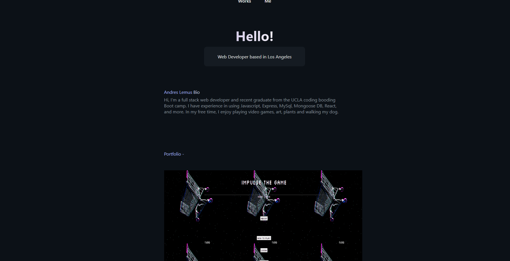

# React Portfolio

# Description 
My personal portfolio built on React showcasing the projects which I have worked on. 

Repository: https://github.com/alemus98/React-Portfolio

Live Link : https://alemus98.github.io/React-Portfolio/

# Preview

# License

This project is covered under the <a href="https://opensource.org/licenses/MIT">MIT License</a>

